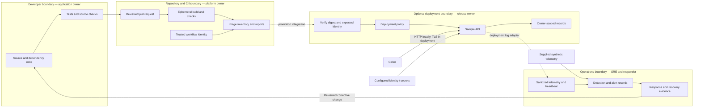

# Reference architecture and worked threat model

Scope: the [sample API](../samples/sample-api/README.md), this repository's build workflow, and the learning exercises. The API has synthetic in-memory records and a server-configured token-to-owner map. It exposes health, item-list, and item-detail routes. There is no database, customer data, payment system, or production identity service in this reference.

The application and local checks are executable. Production TLS/identity, hosted log ingestion, registry promotion, and recovery infrastructure require deployment-specific validation.

## Data flow and trust boundaries

This is a control architecture, not a claim that all services are provisioned. Dashed arrows mark deployment integrations. The runtime lab reads supplied files; it does not monitor a running cluster.

## Assets, actors, and assumptions

| Element | Owner and trust decision |
| --- | --- |
| Synthetic item records | Application owner; only the mapped owner may read each record. |
| Bearer credentials | Configuration owner; never write credentials to logs or release evidence. Demonstration values are for local use only. |
| Source and workflow definitions | Maintainers; contributor-controlled changes must not receive publishing credentials. |
| Built image and SBOM | Release owner; distinguish artifact identity from a mutable tag and bind inventory to the built artifact. |
| Signing identity and verification policy | Platform/AppSec; select issuer, repository, workflow, and ref deliberately. |
| Telemetry, exceptions, and incident records | SRE/program owner; preserve timestamps, access controls, integrity, and retention policy. |

Entry points are HTTP routes, dependency updates, pull requests, build tool downloads, deployment configuration, and imported telemetry. Privileged actions are changing token mappings, required checks or trust policy, approving exceptions, and promoting releases. API callers have no build privileges; a PR author is not automatically a trusted release signer.

Locally, the service binds to loopback and records reset on restart. Before deployment, replace demonstration credentials with managed identity, choose TLS termination and request limits, decide data classification/log retention, and document hosting and RBAC. No production infrastructure is inferred.

## Prioritized risks and verification

Ranks are design-review priorities, not measured likelihood or vulnerability claims against this repository.

| Risk and STRIDE category | Likelihood / impact / detectability assumption | Mitigation and owner | Completion evidence |
| --- | --- | --- | --- |
| Caller receives another owner's item (information disclosure) | Plausible regression; high privacy impact with real records; successful status alone hides the defect. | Application owner enforces ownership on list/detail reads. | API regressions prove own records succeed and other records are unavailable. |
| Credentials appear in code or logs (information disclosure) | Common operational mistake; grants caller access; may remain unnoticed. | Developer avoids defaults and logging credentials; operator rotates exposed credentials. | Secret checks, redacted evidence review, and a deployment rotation exercise. |
| Unreviewed workflow changes gain release trust (tampering/elevation) | Contributor access is expected; impact reaches releases; signatures alone do not prove safe build instructions. | Platform owner restricts publishing identity; maintainers control required checks/reviews. | PR jobs have no release identity; evidence is verified against the selected trusted workflow/ref. |
| Deployment differs from reviewed inventory (tampering) | Plausible promotion mistake; high integrity impact; mutable tags obscure it. | Release owner binds SBOM, verification, and promotion to immutable identity. | Build evidence records artifact identity; registry promotion proves digest agreement. |
| Scanner or sensor stops while dashboards stay quiet (availability/repudiation) | Tool failure is expected; delays response; silence is ambiguous. | Platform fails checks on execution errors; SRE checks heartbeat separately. | Failed commands are nonzero; synthetic fixture creates telemetry-gap alert. |
| Alert causes unnecessary containment (availability) | Misconfiguration resembles misuse; containment can interrupt users. | Incident commander corroborates evidence and chooses reversible actions. | Lab 07 records configuration explanation, recovery checks, and containment decision. |

## Decisions and deployment gaps

The server-owned token map makes authorization tests deterministic; it is not an OAuth implementation. In-memory records make cleanup predictable but do not demonstrate database controls or durable recovery. Synthetic normalized telemetry makes detector behavior testable without installing a privileged sensor.

A service owner must supply identity provider, data classification, hosting boundary, release registry, availability target, log retention, and incident contacts before adapting this design. Record decisions and rerun affected tests. Use the [control catalog](../templates/control-catalog.md) and [worked evidence record](../evidence-packs/example-release.md).

Method references: [OWASP threat modeling](https://owasp.org/www-community/Threat_Modeling), [Microsoft Threat Modeling Tool](https://learn.microsoft.com/en-us/azure/security/develop/threat-modeling-tool), and [OWASP authorization guidance](https://cheatsheetseries.owasp.org/cheatsheets/Authorization_Cheat_Sheet.html). The architecture and ranked assumptions above are specific to this learning reference.
